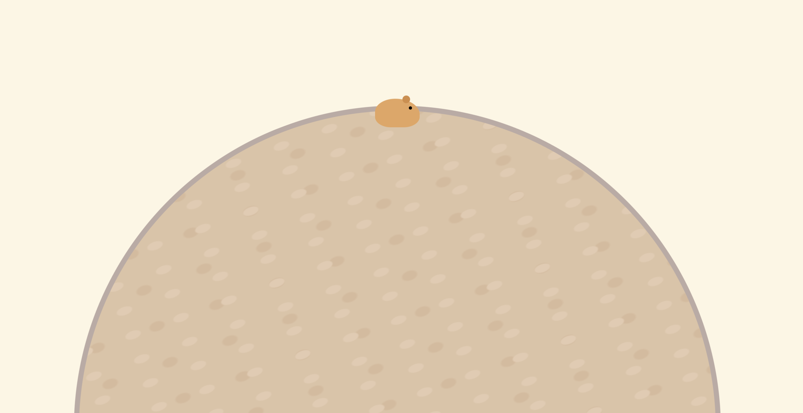
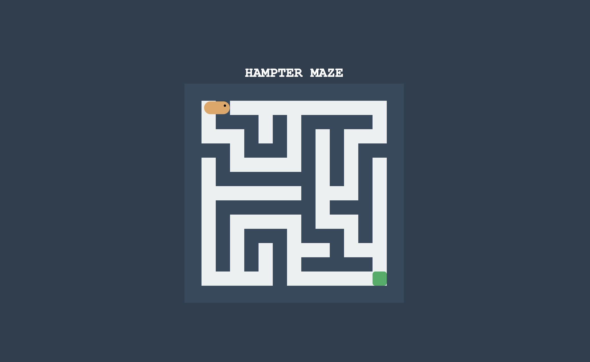

# 🐹 Crazy Hamster

[](https://github.com/nycote99/crazy-hamster)
[](https://nycote99.github.io/crazy-hamster/)
[](https://creativecommons.org/licenses/by-nc/4.0/)




**Crazy Hamster** est une mini-suite d'applications web légères et ludiques. Ce projet combine un jeu de labyrinthe procédural dynamique et un outil de relaxation (Timer Zen), développé sans frameworks pour une performance maximale.

---

## 🚀 Fonctionnalités Phares

### 1. 🏁 Le Labyrinthe (Hampter Maze) v1.1
* **Difficulté Dynamique** : Choisissez entre 3 tailles de matrice (Nain, Syrien, Expert) directement via l'interface.
* **Génération Procédurale** : Algorithme de "Backtracking" garantissant un chemin unique à chaque session.
* **Contrôles Hybrides** : Optimisé pour clavier et tactile (iPhone/Android).

### 2. ⏱️ Timer Zen (Hamster Zen Timer)
* **Animation Synchronisée** : Rotation d'une roue de litière calée sur un cycle de 4 minutes.
* **Zéro Distraction** : Interface épurée pour favoriser la déconnexion.

---

## 📖 Documentation Complète (Wiki)

Pour approfondir le projet, consultez notre **[Wiki Officiel](https://github.com/nycote99/crazy_hamster/wiki)** qui inclut :
* 🛠️ **Architecture Technique** : Détails sur la gestion des matrices et du DOM.
* 📱 **Guide Mobile** : Comment installer l'application sur votre écran d'accueil.
* 🛡️ **Politique de Sécurité** : Détails sur la protection des données et le Code Scanning.

---

## 🧠 Aperçu Technique : Backtracking

Le labyrinthe utilise une exploration en profondeur pour sculpter des chemins dans une matrice de murs (`1`) et de passages (`0`).

```javascript
// Extrait de la logique de génération
if (nx > 0 && nx < gridSize && ny > 0 && ny < gridSize && grid[ny][nx] === 1) {
    grid[y + dy/2][x + dx/2] = 0; // On casse le mur
    walk(nx, ny); // Récursion
}
```

---

## 📄 Licence & Sécurité

* **CC BY-NC 4.0** : Usage personnel uniquement. Revente interdite. 🚫💰
* **Sécurité** : Analyse automatique via **GitHub CodeQL** et signalement privé de vulnérabilités activé.

---
**Développé avec 🐹 par @nycote99**
